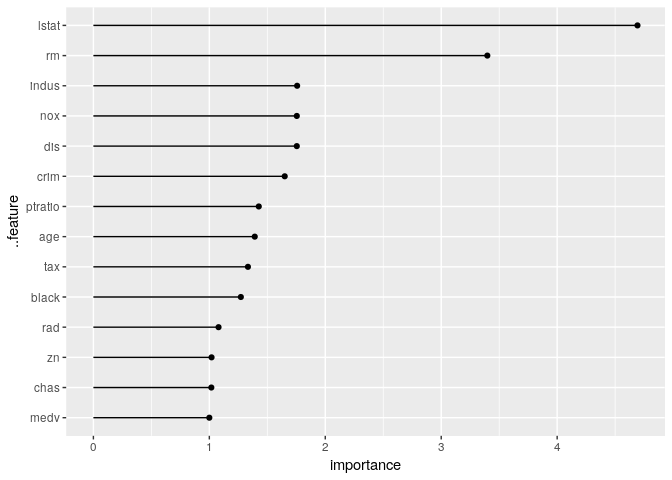
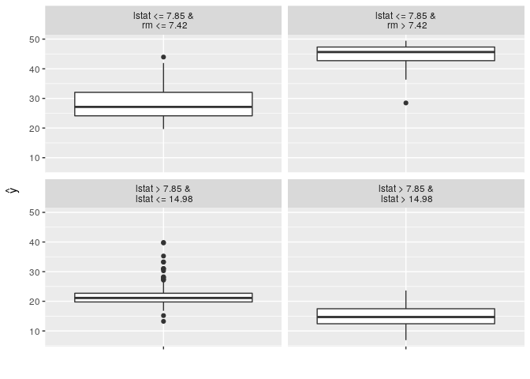
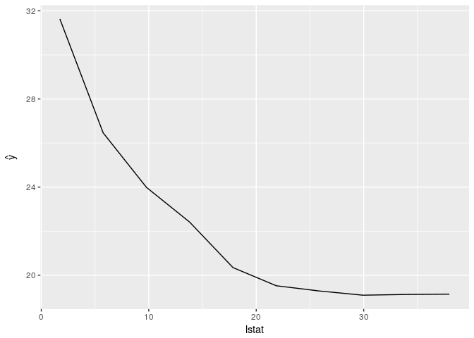
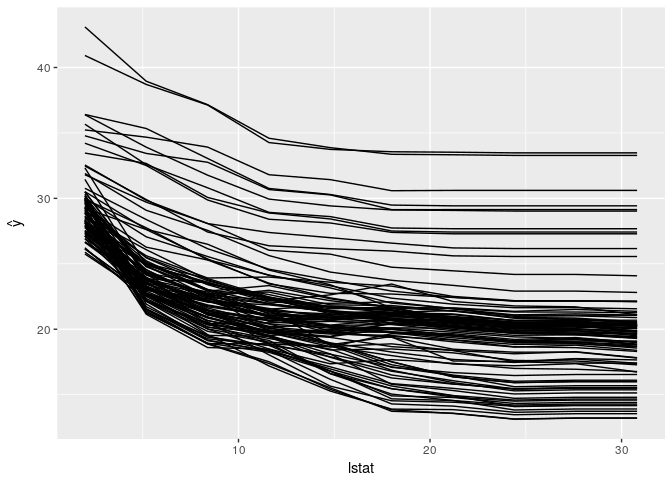
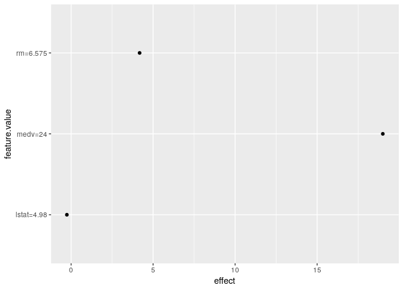
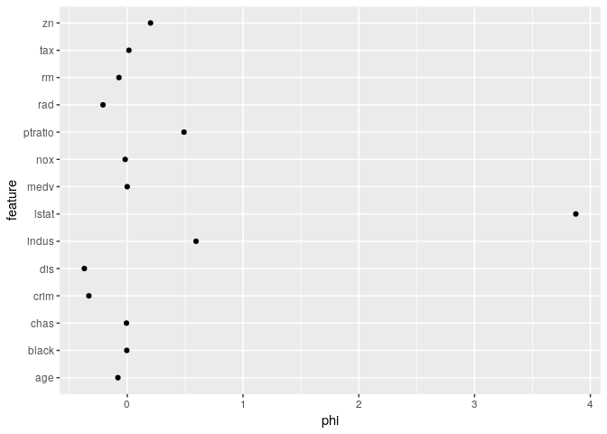

[](https://travis-ci.org/christophM/iml) [](https://CRAN.R-project.org/package=iml) [](https://cran.rstudio.com/web/packages/iml/index.html) [](https://codecov.io/github/christophM/iml?branch=master)

iml: interpretable machine learning
===================================

`iml` is an R package that interprets the behaviour and explains predictions of machine learning models. It implements model-agnostic interpretability methods - meaning they can be used with any machine learning model.

Currently implemented:

-   Feature importance
-   Partial dependence plots
-   Individual conditional expectation plots (ICE)
-   Tree surrogate
-   LocalModel: Local Interpretable Model-agnostic Explanations
-   Shapley value for explaining single predictions

Read more about the methods in the [Interpretable Machine Learning book](https://christophm.github.io/interpretable-ml-book/agnostic.html)

Installation
============

The package can be installed directly from github with devtools:

``` r
# install.packages("devtools")
devtools::install_github("christophM/iml")
```

News
====

Changes of the packages can be accessed in the [NEWS file](https://github.com/christophM/iml/blob/master/NEWS.md) shipped with the package.

Examples
========

First we train a randomForest to predict the Boston median housing value

``` r
library("iml")

library("randomForest")
data("Boston", package  = "MASS")
rf = randomForest(medv ~ ., data = Boston, ntree = 50)
X =  Boston[which(names(Boston) != "medv")]
model = Predictor$new(rf, data = X, y = Boston$medv)
```

#### What were the most important features? (Permutation feature importance / Model reliance)

``` r
imp = FeatureImp$new(model, loss = "mae")
plot(imp)
```



``` r
imp$results
```

    ##    feature original.error permutation.error importance
    ## 1    lstat       1.004678          4.235347   4.215628
    ## 2       rm       1.004678          3.273892   3.258649
    ## 3     crim       1.004678          1.731467   1.723405
    ## 4  ptratio       1.004678          1.729005   1.720955
    ## 5      nox       1.004678          1.661731   1.653994
    ## 6      dis       1.004678          1.653906   1.646205
    ## 7    indus       1.004678          1.608825   1.601335
    ## 8      age       1.004678          1.378753   1.372334
    ## 9      tax       1.004678          1.360375   1.354041
    ## 10   black       1.004678          1.246488   1.240685
    ## 11     rad       1.004678          1.161532   1.156124
    ## 12      zn       1.004678          1.061880   1.056936
    ## 13    chas       1.004678          1.034714   1.029897

### Let"s build a single tree from the randomForest predictions! (Tree surrogate)

``` r
tree = TreeSurrogate$new(model, maxdepth = 2)
plot(tree)
```



### How does lstat influence the prediction on average? (Partial dependence plot)

``` r
pdp.obj = PartialDependence$new(model, feature = "lstat")
plot(pdp.obj)
```



### How does lstat influence the individual predictions? (ICE)

``` r
ice.curves = Ice$new(model, feature = "lstat")
plot(ice.curves) 
```



### Explain a single prediction with a local linear model. (LIME)

``` r
lime.explain = LocalModel$new(model, x.interest = X[1,])
lime.explain$results
```

    ##               beta x.recoded    effect x.original feature feature.value
    ## rm       4.2445268     6.575 27.907764      6.575      rm      rm=6.575
    ## ptratio -0.5224666    15.300 -7.993738       15.3 ptratio  ptratio=15.3
    ## lstat   -0.4287899     4.980 -2.135374       4.98   lstat    lstat=4.98

``` r
plot(lime.explain)
```



### Explain a single prediction with game theory. (Shapley)

``` r
shapley.explain = Shapley$new(model, x.interest = X[1, ])
shapley.explain$results
```

    ##    feature           phi      phi.var feature.value
    ## 1     crim -0.0723403620  1.236298269  crim=0.00632
    ## 2       zn -0.0950710000  0.042044428         zn=18
    ## 3    indus  0.7402716277  1.556442963    indus=2.31
    ## 4     chas -0.0240226667  0.009907358        chas=0
    ## 5      nox -0.1974995303  0.727310327     nox=0.538
    ## 6       rm -0.0752455000  7.788278183      rm=6.575
    ## 7      age -0.0850019791  0.333944689      age=65.2
    ## 8      dis -0.1753825842  1.089173160      dis=4.09
    ## 9      rad -0.4722923333  0.407054214         rad=1
    ## 10     tax -0.1853100000  0.393279176       tax=296
    ## 11 ptratio  0.7285225750  1.220922649  ptratio=15.3
    ## 12   black -0.0008046753  0.267453217   black=396.9
    ## 13   lstat  3.7001500745 19.387675029    lstat=4.98

``` r
plot(shapley.explain)
```



Python Implementation
=====================

Referring to <https://github.com/datascienceinc/Skater>
