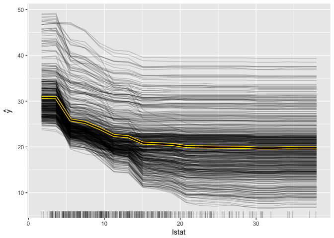

[](https://travis-ci.org/christophM/iml) [](https://CRAN.R-project.org/package=iml) [](https://cran.rstudio.com/web/packages/iml/index.html) [](https://codecov.io/github/christophM/iml?branch=master)

iml: interpretable machine learning
===================================

`iml` is an R package that interprets the behaviour and explains predictions of machine learning models. It implements model-agnostic interpretability methods - meaning they can be used with any machine learning model.

Currently implemented:

-   Feature importance
-   Partial dependence plots
-   Individual conditional expectation plots (ICE)
-   Tree surrogate
-   LocalModel: Local Interpretable Model-agnostic Explanations
-   Shapley value for explaining single predictions

Read more about the methods in the [Interpretable Machine Learning book](https://christophm.github.io/interpretable-ml-book/agnostic.html)

Tutorial
========

Start an interactive notebook tutorial by clicking on the badge: [](http://beta.mybinder.org/v2/gh/christophM/iml/master?filepath=./notebooks/tutorial-intro.ipynb)

Installation
============

The package can be installed directly from CRAN and the develoopment version from github:

``` r
# Stable version
install.packages("iml")
# Development version
devtools::install_github("christophM/iml")
```

News
====

Changes of the packages can be accessed in the [NEWS file](https://github.com/christophM/iml/blob/master/NEWS.md) shipped with the package.

Examples
========

First we train a randomForest to predict the Boston median housing value. How does lstat influence the prediction individually and on average? (Partial dependence plot and ICE)

``` r
library("iml")
library("randomForest")
data("Boston", package  = "MASS")
rf = randomForest(medv ~ ., data = Boston, ntree = 50)
X =  Boston[which(names(Boston) != "medv")]
model = Predictor$new(rf, data = X, y = Boston$medv)
pdp.obj = Partial$new(model, feature = "lstat")
pdp.obj$plot()
```



Python Implementation
=====================

Referring to <https://github.com/datascienceinc/Skater>

Funding
=======

This work is funded by the Bavarian State Ministry of Education, Science and the Arts in the framework of the Centre Digitisation.Bavaria (ZD.B)
