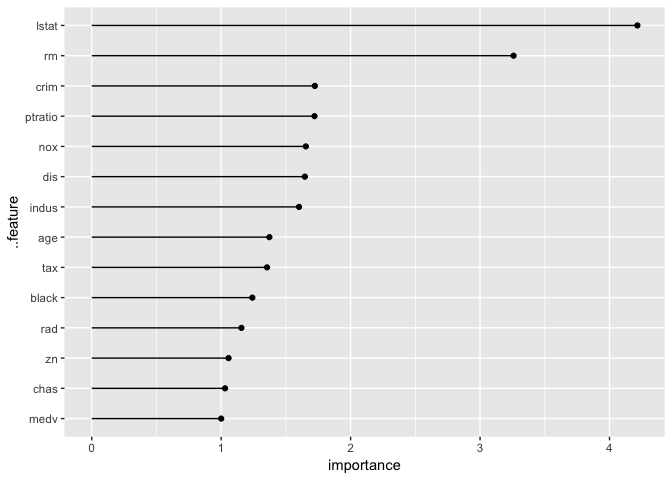
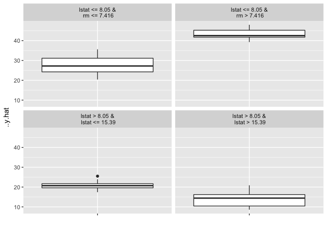
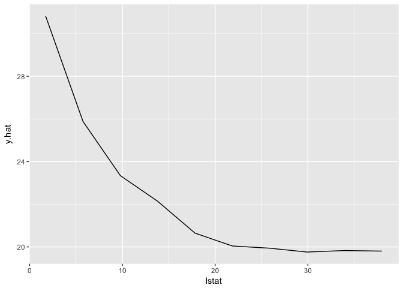
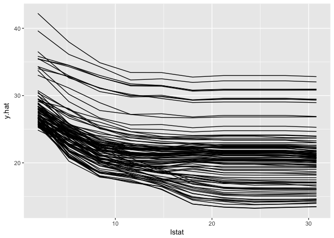
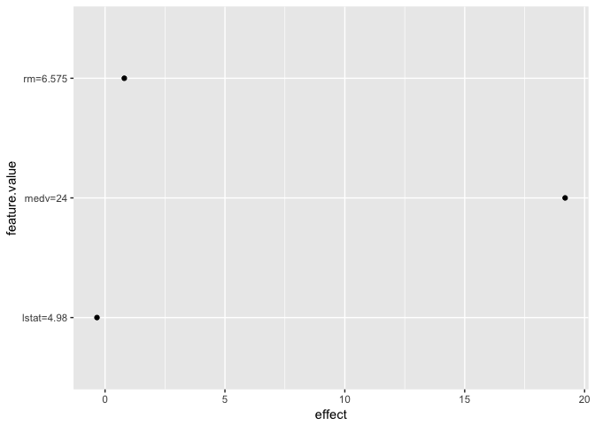
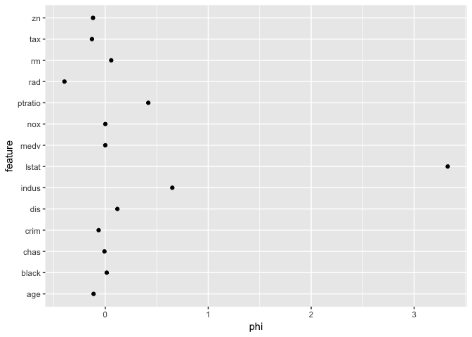

[](https://travis-ci.org/christophM/iml)

iml: interpretable machine learning
===================================

`iml` is an R package that interprets the behaviour and explains predictions of machine learning models. It implements model-agnostic interpretability methods - meaning they can be used with any machine learning model.

Currently implemented:

-   Feature importance
-   Partial dependence plots
-   Individual conditional expectation plots (ICE)
-   Tree surrogate
-   LIME: Local Interpretable Model-agnostic Explanations
-   Shapley value for explaining single predictions

Read more about the methods in the [Interpretable Machine Learning book](https://christophm.github.io/interpretable-ml-book/agnostic.html)

Installation
============

The package can be installed directly from github with devtools:

``` r
# install.packages("devtools")
devtools::install_github('christophM/iml')
```

Examples
========

First we train a randomForest to predict the Boston median housing value

``` r
library('iml')

library('randomForest')
data("Boston", package  = "MASS")
mod = randomForest(medv ~ ., data = Boston, ntree = 50)
```

#### What were the most important features? (Permutation feature importance / Model reliance)

``` r
imp = featureImp(mod, Boston, y = Boston$medv, loss = 'mae')
plot(imp)
```



``` r
imp$data()
```

    ## # A tibble: 14 x 3
    ##    ..feature error importance
    ##    <fct>     <dbl>      <dbl>
    ##  1 age        1.38       1.37
    ##  2 black      1.25       1.24
    ##  3 chas       1.03       1.03
    ##  4 crim       1.73       1.72
    ##  5 dis        1.65       1.65
    ##  6 indus      1.61       1.60
    ##  7 lstat      4.24       4.22
    ##  8 medv       1.00       1.00
    ##  9 nox        1.66       1.65
    ## 10 ptratio    1.73       1.72
    ## 11 rad        1.16       1.16
    ## 12 rm         3.27       3.26
    ## 13 tax        1.36       1.35
    ## 14 zn         1.06       1.06

### Let's build a single tree from the randomForest predictions! (Tree surrogate)

``` r
tree = treeSurrogate(mod, Boston[which(names(Boston) != 'medv')], maxdepth = 2)
plot(tree)
```



### How does lstat influence the prediction on average? (Partial dependence plot)

``` r
pdp.obj = pdp(mod, Boston, feature = 13)
plot(pdp.obj)
```



### How does lstat influence the individual predictions? (ICE)

``` r
ice.curves = ice(mod, Boston[1:100,], feature = 13)
plot(ice.curves) 
```



### Explain a single prediction with a local linear model. (LIME)

``` r
x = Boston[1,]
lime.explain = lime(mod, Boston, x.interest = x)
lime.explain$data()
```

    ##              beta x.scaled     effect x.original feature feature.value
    ## rm     0.12205377    6.575  0.8025035      6.575      rm      rm=6.575
    ## lstat -0.06774873    4.980 -0.3373887       4.98   lstat    lstat=4.98
    ## medv   0.79950263   24.000 19.1880631         24    medv       medv=24

``` r
plot(lime.explain)
```



### Explain a single prediction with game theory. (Shapley)

``` r
x = Boston[1,]
shapley.explain = shapley(mod, Boston, x.interest = x)
shapley.explain$data()
```

    ## # A tibble: 14 x 3
    ## # Groups:   feature [?]
    ##    feature       phi  phi.var
    ##    <fct>       <dbl>    <dbl>
    ##  1 age     -0.114     0.315  
    ##  2 black    0.0143    0.263  
    ##  3 chas    -0.00776   0.00369
    ##  4 crim    -0.0643    1.16   
    ##  5 dis      0.118     2.18   
    ##  6 indus    0.651     1.08   
    ##  7 lstat    3.33     14.0    
    ##  8 medv     0         0      
    ##  9 nox      0.000583  1.33   
    ## 10 ptratio  0.418     1.41   
    ## 11 rad     -0.396     0.352  
    ## 12 rm       0.0579    9.05   
    ## 13 tax     -0.129     0.234  
    ## 14 zn      -0.119     0.0564

``` r
plot(shapley.explain)
```



Python Implementation
=====================

Referring to <https://github.com/datascienceinc/Skater>
