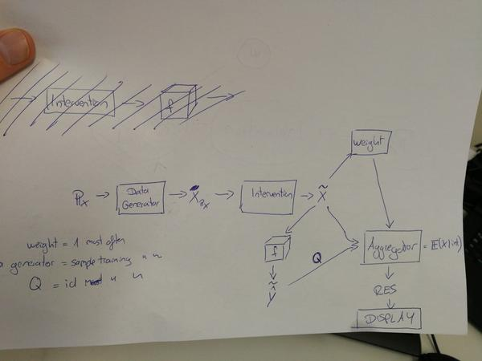

# Content of paper
Modular approach of creating explanations (= feature contributions prediction, feature importance and surrogate models)
Combines LIME, shapley, local/cluster/global interpretability. 
Combines method that dont require refitting of the machine learning model and that work with input, output of ML model. 

# Possible paper titles:
Machine learning interpretability as an intervention framework. 
An intervention-based framework for model-agnostic interpretability methods. 

# Notes and remarks

- Focus on tabular data
- Output is often $E(\hat{y} | X_{something})$. Basically always working with expected values (E(.)), but sometimes this collapses to single point, for example in ICE
- Checkout if you can use some bound to calculate the number of samples you need. See "Algorithmic Transparency viaQuantitative Input Influence", chapter A. Computing Power Indices. They use epsilon-delta approximation and Hoeffding bound. https://en.wikipedia.org/wiki/Hoeffding%27s_inequality. If you can squeeze the quantity of interest between interval $[0,1]$ you can use the Hoeffding bound. Maybe the settings has to be that the quantity of interest is always between $[0,1]$. Should be doable by rescaling (e.g. $y_{star} = \frac{y_{hat} - min(\hat{y})}{max(\hat{y}) - min(\hat{y})}$
- The interventions require to have some marginal distribution, which almost makes it a bayesian approach. Maybe you could frame it as Bayesian approach. Intervention = using prior of one feature, which might be estimated from the marginal distribution of a feature for example. Posterior distribution has no meaning though, right?
- Confidence intervals can be introduced by all measurements by repeating the procedure framework, which ultimately yields bootstrapped results for the quantity of interest, depending on your generate.data.fun. 
- The outcome of the interpretability method is, so far, always one number (or plot) per feature. Maybe this is useful for formulating and simplyfying the framework. 
- All methods work with marginal and or conditional expectations. ICE: conditional. PDP: marginal. Difference also to sensitivity and uncerntainty analysis approaches: They often are not defined with distribution of input variables in mind and use grid/random/pseudo-random input. 
- PDPs can be seen from the functional Anova view: $f_{x_u}(x) = \int_{x_{-u}}(f(x) - f(\emptyset))dx_{-u} = \int_{x_{-u}}(f(x))dx_{-u} - \mu$, where $\mu = \bar{f}(x)$ (the mean prediction over the data). PDPs are the same, but without the $\mu$ constant. This is another argument that the framework aggregation function does something like Q(b  efore after intervention) - Q(after intervention).
- When you want to evaluate the f(x) and get one number, you have to decide for each feature, if you want to condition on it (= fix to value) or if you want to marginalise it (= average over distribution for the feature). 
- Iml framework is using Monte Carlo A lot
- There are 3 types of interpretability methods, and a method can have more than one type:
  - Feature importance: Ranks features. Example permutation feature importance. Makes use of interventions. Aggregation usually single number per feature. 
  - Feature effects: Summarises how feature contribute to prediction. Example: PDp, Shapley. Makes use of interventions, aggregation either conditional on feature grid or one number per feature. 
  - Surrogate models: Fit an interpretable model on black box. Example: LIME(, Shap?). Makes no use of intervention. Makes use of weights. Aggregation is a model fit. 
- common among all methods: the resulting aggregation is always per feature. only outlier: surrogate models, when model is not a linear combiniation of features (for example a tree). 
- Within the framework, the features change between different modes:
  - conditioned feature: The f() is conditioned on certain values of the feature
  - marginalised feature: f() is marginalised over the feature. Usually done via Monte carlo
  - interventioned feature: The feature receives an intervention before it goes into f(). Then usually in a conditioned way. 
  - Examples:
    - ICE: Condition on all features of instance of interest, excluding the feature of interest. Intervene on feature of interest. 
    - PDP: Marginalise all features, excluding feature of interest. Intervene and condition on feature of interest. 
    - Shapley: In each loop: Condition on "players in the room" (=intervention?), marginalise over players not in the room. Then exclude  feature of interest from players in the room and do the same. Calculate the difference
    - LIME: Doesnt really fit these steps. 
    - Permutation feature importance: Marginalise over all features after intervening on feature of interest. - Feature importance: Quantity of interest is either performance or variance of model
- Feature effects: Quantity of interest is $\hat(y)$
- Surrogate models: Quantity of interest is: g, where g is from class of interpretable models and fidel to f?

# Value of paper
- High abstraction view of interpretability methods
- Unification of methods
- Explore new things that arises naturally from modular system, like explaining clusters against dataset, or instance against cluster, or instance against archetype (=single instance as well).
- R package
- Extend "Algorithmic Transparency viaQuantitative Input Influence" by allowing numerical features, showing how it is the same as ICE / PermImp / ..., discovering more use cases (cluster vs complete data etc.)
- By showing the similarity between the algos and they all go through the same predict(someX), results can be memoised and reused. The framework will make it more efficient when you want to have multiple iml analyses.

# TODOs:
- Read DeepLift paper and decide if it fits into the framework or if it even should.
- List interesting quantities of interest (probability for class, probability for own class, numerical prediction, Performance, Group differences (e.g. men and women).
- Demonstrate how to switch between local and global explanations within the framework
- Demonstrate how to differentiate between feature effects and feature importance within the framework.
- 

# Moving parts for interpretation

## Input:
- features $X$
- outcome $y$
- learned $\hat{f}$
- interpretable features $X'$
- mapping $h()$ that maps from $X'$ to $X$t

## Modules
See also implementation in sensitivity package and paper: Algorithmic Transparency viaQuantitative Input Influence

- Quantity of interest, e.g. performance, prediction, probability for certain class
- Difference measure for comparing quantity of interest before and after intervention
- *Instance selector*: Which instances should be explained? Ranging from a single instance to cluster (or even all instances, e.g. pdp)
- *Feature selector*: Which features should be integrated. For LIME, shap, shapley: all. For pdp, it is only one or two features at a time. This point could be omitted as well or at least not be the biggest point. Feature selector step could be omitted in the overview, since it is not important and does not really allow to find new things that arise from the modular system.
- *Quantity of interest* What shall be compared? DPD, ICE, LIME, Shapley, Shap: Predicted value. Feature Importance: Performance. Sobol/Shapley for var: Variance
- *Reference/background/intervention sampler*: Function that returns n samples. Against which data (instances) should the prediction of selected instance be compared to? For shapley or pdp the function draws samples from the training data. For LIME it draw from the data points that are generated each feature independently with mean and variance sampling. This sampling can also be seen as doing an intervention on this variable. For ICE it is not clear, whether the single lines are generated from the background sampler or a selected X.interest: Those are different point of views. If you want ICE for specific datapoint, no data generator needed. If you are only interested in the distribution of lines, you would just use the data generator.  
- *Weighting*: How the background data should be weighted. In LIME it is with the kernels. In shapley it is 1 for each sampled background. In shap paper it is weighted by the shap kernel. For better overview, this step could be integrated into the background sampler strategy. Disadvantage: If seperated, it is clearer in LIME that samples can be reused for each explanation.
- *Intervention* (dpd: create multiple datasets from trainding dat, each time shuffle one variable.)
It's a function g(x, x') that projects from the cartesian X product to X: XxX -> X
One x comes from the reference distribution P_X, the other from some other distribution (marginal distribution for permutation feature importance, normal dist with mean and var from one feature for lime) or a grid (dpd, ice) or just from one instance.  Break the association between features. For ICE and PDP: Force grid. For Permuation importance: force shuffle of one variable.
- *Get predictions* (always the same I guess?. only more complicated if you have some kind of adaptive sampling procedure). Or more general: measure some quantity of interest, that is likely a function of the prediction. In case of permutation feature importance it is the Performance you measure.
- *Fitting process  / Statistic on collected data* (LIME: linear model, pdp: avg by x-grid, shapley: avg, shap: lin mod). Apart from LIME, a lot have the formula $\hat{y}_{instance of interest} - \hat{y}_{background}$
- *Attribution method*: How changes in the quantity of interest are attributed to features (in case multiple features are possibly involved). For shapley, shap: shapley value attribution. For LIME it means fitting a linear model. ICE, PDP, permutation feature importance it is not necessary, because only one variable was focused. For permutation feature importance
- *Repeat and overlay*: How often should the previous steps be repeated and overlayed? Examples: ICE (multiple runs but with different instances and instance, pdp: multiple runs with different features, aLIME: multiple runs with different instances)

## How to do comparisons using this framework
- What do you want to compare (e.g. single instance) against what (e.g. complete data distribution)
- What do you want to measure (e.g. prediction or performance)
- How do you want to compare the measures (e.g. difference)
- How do you want to attribute comparison differences (e.g. Shapley or a simple comparison (like ICE or DPD))
- How do you want to aggregate the comparisons across instances
- How do you want to aggregate the comparisons across features

## Examples embedded in framework

### LIME
- Instance selector: Select single instance
- Feature selector: Select X'
- Background data selector: Select training data X_T
- Background sampler: Sample from background mean and variance
- Weigh by euclidean distance to instance
- data generator: nothing?
- predict $\hat{y}$
- fit weighted LASSO

### Shapley
- Instance selector: Select single instance x_i
- Feature selector: Select X
- Background data selector: Select training data X_T
- Background sampler: Sample random instances from X_T
- Weigh with value 1
- data generator: create frankenstein instances by combining x_i and samples from X_T
- predict $\hat{y}$ for each sample
- create mean diff from frankenstein instances

### Partial dependence plots
- Instance selector: select all
- Feature selector: select one (or two) feature(s) x_j (and x_k)
- Background data selector: select training data X_T
- Background sampler: choose all
- weigh with value 1
- data generator: |x_grid| x n sized dataset, in each iteration feature x_j is forced to be a x_grid value
- predict $\hat{y}$ for each new instance
- average by x_grid value

### Permutation feature importance
- Instance selector: all instances usually, but also cluster might be interesting.
- feature selector: select one feature x_j
- background selector: usually training data X_T (could also be a smaller set, when instance of interest smaller set)
- Background sampler: take all
- weight with value 1
- data generator: generate additional $n_{perm}$ datasets with permuted feature $x_j$
- predict $\hat{y}$
- compare performance measure between

### PIMP?

### Sobol index?

## Similar papers

### "Algorithmic Transparency viaQuantitative Input Influence"
- Follows exactly this framework. Actually is kind of this framework, but not written down properly and not shown that it's all the same scheme.
- They don't compare it with dpd, ice, pimp and so on
- They don't show what it extends to (except of course for their own things they use in the transparency report.
- They only talk about categorical features, I will generalize it towards numerical features. also ordinal?
- They write: "A thorough exploration of other points in this design space remains an important direction for future work.". See als next chapter: New things that arise from modular view. So I am basically doing what they suggest.
- Their notation sucks. I will do it better with usual notation from statistics field.
- What's weird in their paper: They use shapley only for their "Set QII" which involves the influence of multiple variables. But they don't use shapley for a single variable.

## New things arising from modular view
- explaining clusters against dataset
- explaining instance against cluster
- explaining instance against instance, e.g. archetype (=single instance as well)
- relative feature importance, by choosing single instance and comparing feature importance against background.
- feature importance in cluster compared to whole datase
- weighted feature importance measures
- pdps are essentially a special case of shapley value. We only check the contribution for one variable and do so multiple times to get  a curve over the feature range.
- permutation feature importance for whole dataset with shapley value: value = performance with all vars minus performance with only mean prediction. attribute performance gains with shapley value, by pertubing

What does not work:
Choosing all instances in instance selector for shapley should yield estimate of zero??
