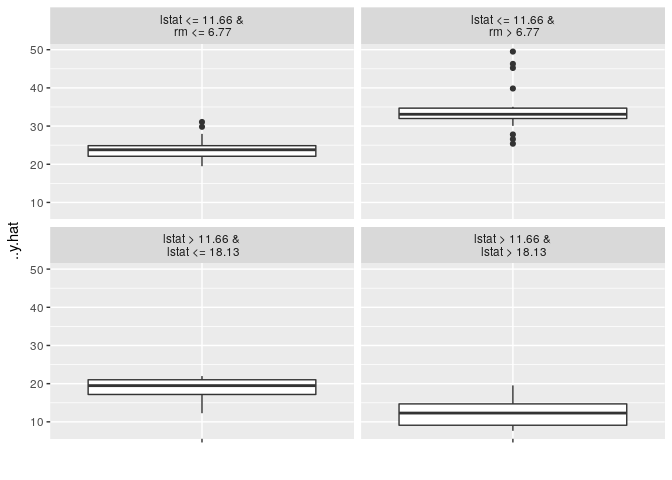
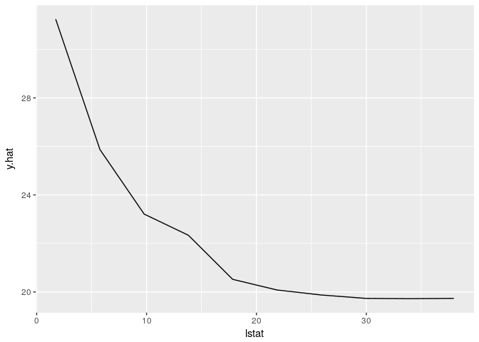
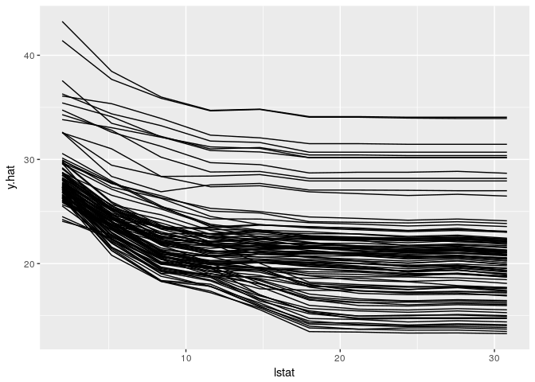
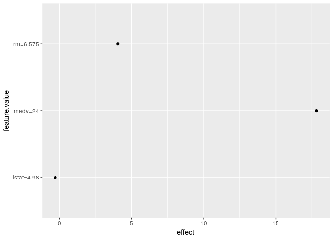
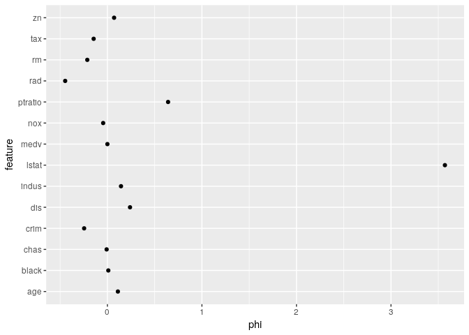

[](https://travis-ci.org/christophM/iml)

iml: interpretable machine learning
===================================

`iml` is an R package which provides methods to explain behaviour and predictions of machine learning models. It implements model-agnostic interpretability methods - meaning they can be applied to any model type. Currently implemented: - Feature importance - Partial dependence plots - Individual conditional expectation plots (ICE) - Tree surrogate - LIME: Local Interpretable Model-agnostic Explanations - Shapley value for explaining single predictions

An R package for Interpretable machine learning
-----------------------------------------------

Examples
========

Installation
============

The package can be installed directly from github with devtools:

``` r
devtools::install_github('christophM/iml')
```

    ## Downloading GitHub repo christophM/iml@master
    ## from URL https://api.github.com/repos/christophM/iml/zipball/master

    ## Installing iml

    ## '/usr/lib/R/bin/R' --no-site-file --no-environ --no-save --no-restore  \
    ##   --quiet CMD INSTALL  \
    ##   '/tmp/RtmpGnBeEU/devtools210c2361ba23/christophM-iml-8978278'  \
    ##   --library='/home/chris/R/x86_64-pc-linux-gnu-library/3.3'  \
    ##   --install-tests

    ## 

``` r
library('iml')

# Train a randomForest to predict the Boston median housing value
library('randomForest')
```

    ## randomForest 4.6-12

    ## Type rfNews() to see new features/changes/bug fixes.

``` r
data("Boston", package  = "MASS")
mod = randomForest(medv ~ ., data = Boston, ntree = 50)

# What were the most important features? (Permutation feature importance / Model reliance)
imp = feature.imp(mod, Boston, y = Boston$medv, loss = 'mae')
imp$data()
```

    ## # A tibble: 14 x 3
    ##    ..feature error importance
    ##    <fct>     <dbl>      <dbl>
    ##  1 age       1.39        1.47
    ##  2 black     1.21        1.28
    ##  3 chas      0.975       1.03
    ##  4 crim      1.65        1.75
    ##  5 dis       1.64        1.74
    ##  6 indus     1.35        1.43
    ##  7 lstat     3.98        4.22
    ##  8 medv      0.944       1.00
    ##  9 nox       1.70        1.80
    ## 10 ptratio   1.71        1.81
    ## 11 rad       1.06        1.12
    ## 12 rm        3.71        3.93
    ## 13 tax       1.31        1.39
    ## 14 zn        0.994       1.05

``` r
plot(imp)
```


``` r
# Let's build a single tree from the randomForest predictions (Tree surrogate)
tree = tree.surrogate(mod, Boston[which(names(Boston) != 'medv')], maxdepth = 2)
plot(tree)
```



``` r
# How does lstat influence the prediction on average? (Partial dependence plot)
pdp.obj = pdp(mod, Boston, feature = 13)
plot(pdp.obj)
```



``` r
# How does lstat influence the individual predictions? (ICE)
ice.curves = ice(mod, Boston[1:100,], feature = 13)
plot(ice.curves) 
```



``` r
# Explain the prediction of the first instance with a local linear model: (LIME) 
x = Boston[1,]
lime.explain = lime(mod, Boston, x.interest = x)
```

    ## Loading required package: glmnet

    ## Loading required package: Matrix

    ## Loading required package: foreach

    ## Loaded glmnet 2.0-13

    ## Loading required package: gower

``` r
lime.explain$data()
```

    ##              beta x.scaled    effect x.original feature feature.value
    ## rm     0.61682698    6.575  4.055637      6.575      rm      rm=6.575
    ## lstat -0.06071024    4.980 -0.302337       4.98   lstat    lstat=4.98
    ## medv   0.74237335   24.000 17.816960         24    medv       medv=24

``` r
plot(lime.explain)
```



``` r
# Explain the prediction with game theory (Shapley)
x = Boston[1,]
shapley.explain = shapley(mod, Boston, x.interest = x)
shapley.explain$data()
```

    ## # A tibble: 14 x 3
    ## # Groups:   feature [?]
    ##    feature      phi  phi.var
    ##    <fct>      <dbl>    <dbl>
    ##  1 age      0.111    0.441  
    ##  2 black    0.00969  0.0667 
    ##  3 chas    -0.00805  0.00159
    ##  4 crim    -0.246    2.05   
    ##  5 dis      0.239    0.595  
    ##  6 indus    0.144    0.619  
    ##  7 lstat    3.57    16.3    
    ##  8 medv     0        0      
    ##  9 nox     -0.0448   0.950  
    ## 10 ptratio  0.642    0.846  
    ## 11 rad     -0.447    0.513  
    ## 12 rm      -0.213    7.64   
    ## 13 tax     -0.145    0.883  
    ## 14 zn       0.0709   0.0844

``` r
plot(shapley.explain)
```


